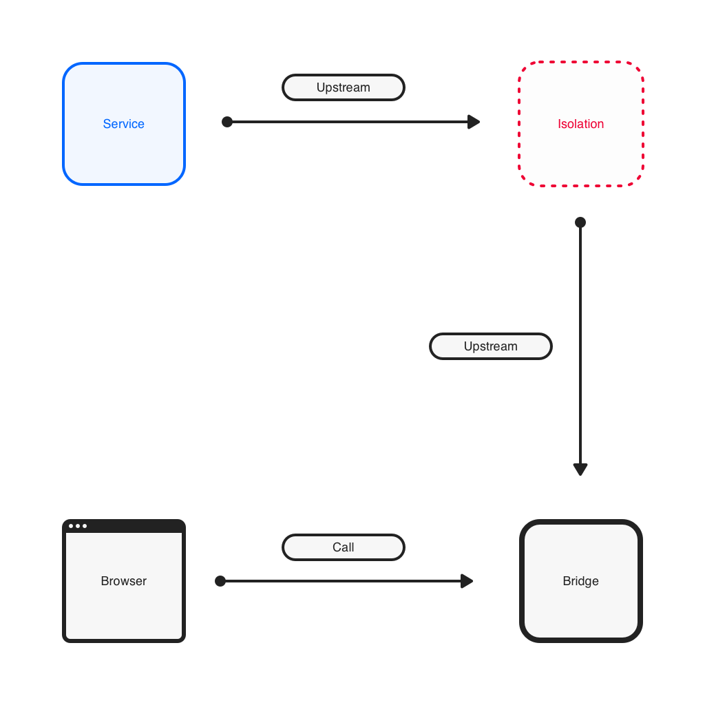

<a href="https://github.com/ljun20160606/bifrost/blob/master/LICENSE"></a>
<a href="https://travis-ci.org/ljun20160606/bifrost"></a>

## Bifrost

内网穿透工具，名字的灵感来自战神4中北欧神话的彩虹桥

### 架构



### 实现内容

* [x] socks5协议实现
* [x] 网桥
* [x] 代理客户端
* [x] 本地socks->socks免校验代理

## 使用

在内网启动`service`，在公网启动`bridge`，使用`socks5`代理连接`bridge`的`proxy`端口即可使用`service`的内网环境，
所有的请求都会被`service`代理，支持多`bridge`、多`service`的部署方式

### 任意访问内网

```bash
# 启动网桥，网桥必须在service和client都可以访问的环境下启动
$ bifrost bridge
# 启动代理客户端
$ bifrost service
# 外网启本地代理
$ bifrost proxy
```

我使用的代理工具是`Chrome`上的`Proxy SwitchyOmega`，`sock5`协议代理到本地`8080`端口，done，事实上bifrost proxy本身是可以省略的，但是`SwitchyOmega`不支持Sock5 Auth，所以使用proxy中转了一下No Auth的请求。

### 端口映射

```bash
# 启动网桥，网桥必须在service和client都可以访问的环境下启动
$ bifrost bridge
# 启动代理客户端
$ bifrost service
# 外网启动端口映射，r参数代表你希望访问的内网端口
$ bifrost mapping -r=127.0.0.1:6666
```

脚本本身支持自定义参数详情可以

```bash
# 了解帮助信息
$ bifrost -h
```

## 功能说明

### 负载均衡

允许使用相同组注册到bridge，根据机器临时id一致性hash策略选择service

### 多路复用

bridge和service通信使用多路复用策略